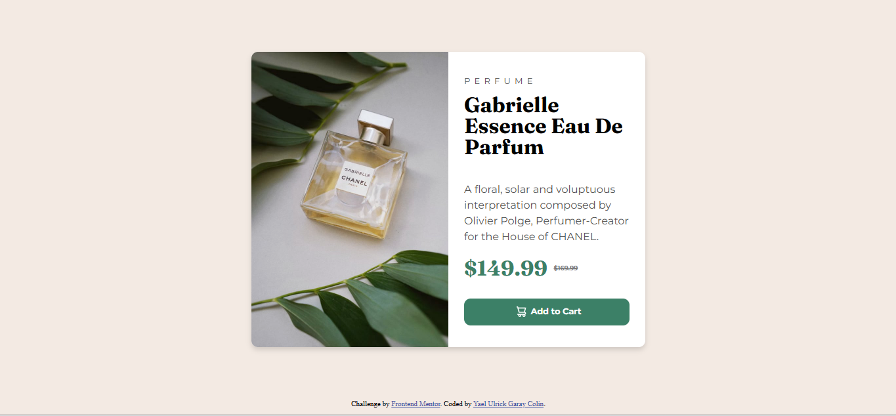

# 📱 Frontend Mentor - Tarjeta de de compra responsive

Este proyecto es una solución al reto de [Frontend Mentor](https://www.frontendmentor.io/challenges/qr-code-component-iux_sIO_H) para construir un componente de tarjeta con un de blog**usando responsive**.  
El objetivo fue practicar **el responsive con CSS**, centrar un contenedor en pantalla y trabajar con **Flexbox** para alinear los elementos.

---

## 📑 Contenido
- [Vista previa](#vista-previa)
- [Tecnologías](#tecnologías)
- [Retos y aprendizajes](#retos-y-aprendizajes)
- [Conclusión](#conclusión)
- [Autor](#autor)

---

## 📸 Vista previa
Aquí una captura de cómo se ve el resultado final:  

---

## 🛠️ Tecnologías
Este proyecto se construyó con:

---

## 🚀 Retos y aprendizajes
🔹 Uno de los retos de este proyecto fue acomodar la imagen acorde al tamaño alto del contenido descriptivo de la tarjeta

---

## 📚 Conclusión
Este proyecto me ayudó a:  
- Comprender con más claridad el uso de Flexbox.  
- Analisar el uso **de flexbox y medias querys**.  
- Valorar la importancia de practicar con proyectos pequeños para mejorar en desarrollo web.  
- Reforzar la estructura principal del HTML y CSS

---

## 👨‍💻 Autor

**Ing. Yael Ulrick Garay Colin**  
💼 Desarrollador Web | Front-End Enthusiast  

---
