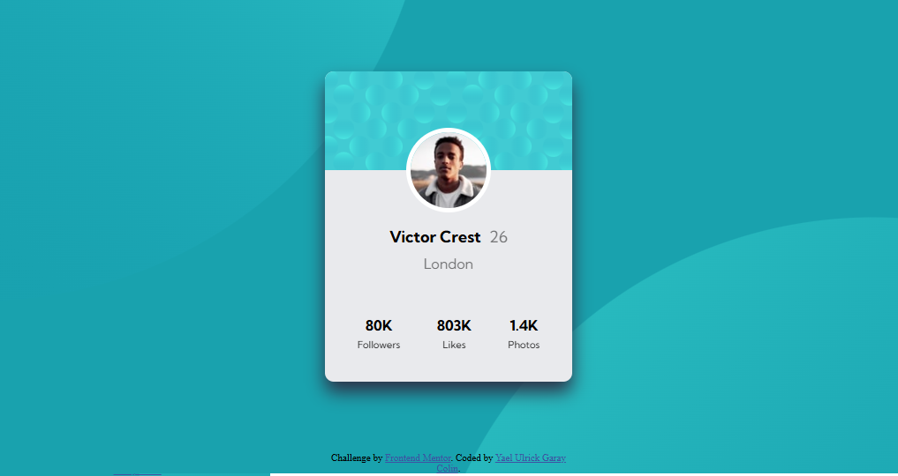

# 📱 Frontend Mentor - Card social

Este proyecto es una solución al reto de [Frontend Mentor](https://www.frontendmentor.io/challenges/profile-card-component-cfArpWshJ) para construir una **Carta social**.  
El objetivo fue perfeccionar con la practia para quienes quieran poner a prueba sus conocimientos de CSS Grid. Grid es una herramienta tan potente para CSS que vale la pena familiarizarse con ella, y el uso de imagenes en background.

---

## 📑 Contenido

- [Vista previa](#vista-previa)
- [Tecnologías](#tecnologías)
- [Retos y aprendizajes](#retos-y-aprendizajes)
- [Conclusión](#conclusión)
- [Instalación y uso](#instalación-y-uso)
- [Autor](#autor)

---

## 🚀 Vista Previa del Resultado

El diseño es completamente _responsive_ y se adapta a diferentes tamaños de pantalla, manteniendo la proporción y el flujo.

### Desktop

### Mobile

---

## 🛠️ Tecnologías

Este proyecto se construyó con:

---

## 🚀 Retos y aprendizajes

🔹 Conocer la importancia de una buen estructura HTML para escribir CSS limpio
🔹 Aplicar el elemento grid-template-area para asignarlo nombres a cada recuadro o espacio
🔹 Aplicar la metodologia BEM
🔹 El uso de imagenes en background

---

## 📚 Conclusión

Este proyecto me ayudó a:

- Analizar con mayor detenimiento como se generará la estructura HTML
- Aplicar nommbres de areas a los articulos para su manipulación en GRID
- Analizar el acomo de bloques, elementos y modificadores
- Entender de mejor manera el uso de imagenes en background

---

## 👨‍💻 Autor

**Ing. Yael Ulrick Garay Colin**  
💼 Desarrollador Web | Front-End Enthusiast

---
